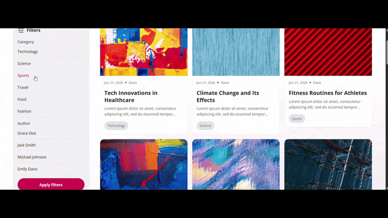

# DWS Blog Frontend

A blog interface where you can browse posts, then filter, search, and sort them, and open any post to read its full details. Built as part of a technical assessment.



View blog posts, apply filter, search, sort and view post details.

## Tech Stack

- React
- TypeScript
- TanStack React Query
- SCSS
- Vite

## Getting Started

### Install dependencies

```bash
npm install
```

### Run the development server

```bash
npm run dev
```

Then open:

```
http://localhost:5173
```

## Architecture decisions

- Vite for a fast dev environment
- Component-driven architecture with reusable base components
- A services layer to isolate API logic
- CSS media queries plus a custom hook to switch between mobile and desktop views
- Custom hooks to keep components clean, share logic, and separate it from the UI
